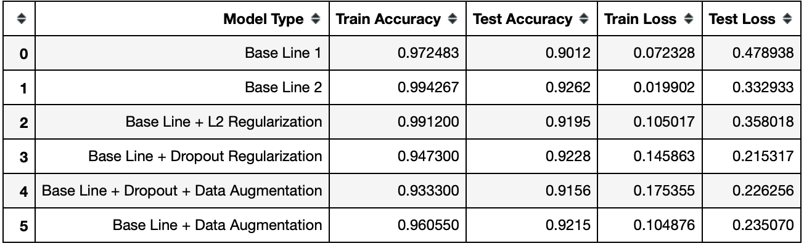

# Apparel Image Recognition using CNN 

**Goal:** Classify apparel images into right categories by building and optimising Convolutional Neural Network (CNN) using Keras. 

**Dataset:** Fashion-MNIST is a dataset of [Zalando's](https://jobs.zalando.com/en/tech/) article images—consisting of a training set of 60,000 examples and a test set of 10,000 examples. 
Each example is a 28x28 grayscale image, associated with a label from 10 classes. Data can be directly loaded from Keras.datasets. 

**Approach:** Started with building a baseline model and then optimizing its architecture using different regularization methods for maximising test accuracy. 

**Jupyter Notebook** Apparel Image Recognition.ipynb contains the entire code, visualizations, analysis and results for this project.

**Results:** 
Below is the table summarizing different models and evaluation metric, and the confusion matrix on how we are doing on different categories. 

* Here loss refers to the corss-entropy loss which is indicative of how confident we are for our predicitons. Lower the better. 

Baseline + Dropout regularization is best model considering the significant lower loss at a high test accuracy of **92.3%**.

Model is having difficulty distinguishing between Shirt, court, Pullover, T-shirt/top and between Sneaker/Ankle Boot. 

We are short of test accuracy by about 8%, below are random sample of images that we could not predict correctly. 

**Acknowledgement:** 
- Deep Learning Specialization course with Andrew Ng on Coursera
